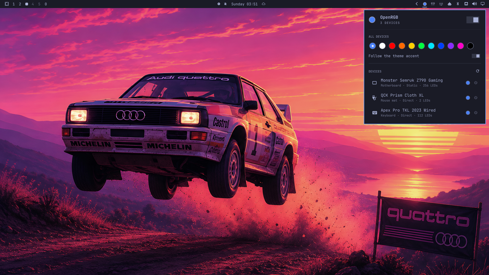

# OmaRGB

RGB lighting from the Omarchy bar, following your theme. Switch themes and
the keyboard, the board, the strips switch with it. Built on
[OpenRGB](https://openrgb.org). A community plugin, not part of Omarchy itself.

A dot in the bar shows what color your hardware is lit right now. Click it
and you get a panel listing every device OpenRGB can see, with its mode,
color, brightness and speed. Keyboards, mice, mouse mats, motherboards, RAM,
GPUs, strips, whatever OpenRGB supports.

The panel mirrors the server instead of only sending to it. Change a color
from the OpenRGB app, a game, or any other SDK client and the bar catches up
within a couple of seconds.

Two things I wanted badly enough to build this for. The theme switch above,
which keeps all the lighting on the theme's accent. And stealth mode, which
turns every light off with one click and remembers what each device had,
mode and color, so switching back puts it all back. Each device also has its
own power button, for when only the keyboard should go dark.



A minute of it in use, including a theme switch recoloring the hardware:

https://github.com/user-attachments/assets/9f925658-7a47-47d5-9acb-0de2783d4ae9

## Requirements

- Omarchy 4 (the Quattro shell). This is a shell plugin, not a standalone app.
- [OpenRGB](https://openrgb.org) 0.9 or newer. The plugin offers to install it and starts its SDK server itself.
- `python3`, which Omarchy already ships. The bridge has no other dependency.

## Install

```bash
omarchy plugin add https://github.com/ilkaydnc/omargb.git --enable
```

That is the whole setup. The widget lands in the bar's right section; move it
with `omarchy bar move io.github.ilkaydnc.omargb --section center`.

OpenRGB is the one dependency, and the plugin takes care of it. When it is not
installed yet, the panel says so and offers an Install OpenRGB button. That
opens a terminal, installs the package through Omarchy's own package helper
and loads `i2c-dev`; the sudo prompt is the usual one, in your own terminal.
Nothing has to happen before the plugin is enabled. If you would rather do it
yourself:

```bash
~/.config/omarchy/plugins/io.github.ilkaydnc.omargb/setup
# or just: sudo pacman -S openrgb
```

Installing the package fires pacman's udev hook, which reloads and re-triggers
OpenRGB's rules, so USB devices work right away without a replug. Motherboard
and RAM lighting goes over SMBus and needs `i2c-dev`. The package loads it on
the next boot and `setup` loads it immediately. Some boards also need the
`acpi_enforce_resources=lax` kernel parameter. Check the OpenRGB wiki for your
board before adding it, then verify with `openrgb --list-devices`.

If a device is missing from the panel, it is missing from OpenRGB. The panel
shows exactly what the server reports and nothing else. GPUs are the usual
case. Whether a card's lighting works depends on OpenRGB's per-model support,
not on this plugin, and a card OpenRGB learns later shows up here on its own.

### Uninstall

```bash
omarchy plugin remove io.github.ilkaydnc.omargb
```

That deletes the plugin folder and its entry in `~/.config/omarchy/shell.json`,
which is the only file the plugin ever writes to, and only its own entry in
it. Nothing else is touched. OpenRGB stays installed; remove it with
`sudo pacman -R openrgb` if you no longer want it, and delete
`~/.config/OpenRGB` for its own settings. If the plugin started an OpenRGB
server in the current session, it exits with the shell.

### The SDK server

The bar talks to OpenRGB's SDK server on `127.0.0.1:6742`. If nothing answers,
the plugin launches `openrgb --server --noautoconnect` itself, once per
session. That is the *Start the OpenRGB server when none is running* setting,
on by default. The panel also has a Start OpenRGB server button.

To run the server on its own, independent of the shell, a user unit does it:

```ini
# ~/.config/systemd/user/openrgb.service
[Unit]
Description=OpenRGB SDK server
After=graphical-session.target

[Service]
ExecStart=/usr/bin/openrgb --server --noautoconnect
Restart=on-failure

[Install]
WantedBy=default.target
```

```bash
systemctl --user enable --now openrgb
```

The plugin connects to whatever is listening. Turn its auto-start off in the
widget settings if you manage the server this way.

## Using it

| Action | Effect |
|---|---|
| Left click the dot | Open/close the panel |
| Right click the dot | Paint the theme accent on every device |
| Middle click the dot | Toggle *Follow the theme accent* |

In the panel, the All devices swatches recolor everything at once. The first
swatch is the theme accent. The switch at the top of the panel is the master
light switch. Off is stealth mode.

Each device row has a power button and expands into its controls. Mode. Color,
as swatches plus hue, saturation and value sliders that the device follows
live while you drag. Brightness and speed where the mode has them, always as
a percentage, even on controllers that count their speed backwards. Save to
device appears for modes the hardware can keep across reboots.

Two switches look after themselves. *Follow the theme accent* turns itself off
when you pick a color of your own or put a device on one of its hardware
effects. Your choice wins, and the next theme change will not paint over it.
Stealth is simply "every device is off", so powering one device back on by
hand clears the switch too.

The accent reaches the hardware in a saturated form by default. LEDs render a
muted accent as a whitish glow. A screen shows gray through context; an LED
just emits, and three near-equal channels read as white. So the hue is kept
and lifted to something the LEDs can show. The `vividAccent` setting turns
this off. A truly gray accent stays white either way, since there is no hue
to amplify.

Keyboard: `j`/`k` or arrows walk the devices, `Enter` expands one, `h`/`l` step
its mode, `a` applies the accent everywhere, `t` toggles theme sync, `o`
toggles stealth mode, `r` refreshes, `s` saves the selected device's mode,
`Esc` closes, `Tab` moves to the neighbouring panel.

### Scripting

The widget registers the `omargb` IPC target, so keybindings and scripts can
drive it:

```bash
omarchy-shell omargb toggle
omarchy-shell omargb setAll '#ff4000'
omarchy-shell omargb applyAccent
omarchy-shell omargb themeSync true
omarchy-shell omargb stealth true
omarchy-shell omargb toggleStealth
omarchy-shell omargb refresh
```

The bridge works on its own too. To dump what OpenRGB reports:

```bash
python3 ~/.config/omarchy/plugins/io.github.ilkaydnc.omargb/bridge/openrgb_bridge.py --once
```

## When a zone paints the wrong color

Everything this plugin sends goes through OpenRGB's own drivers untouched. A
wrong color on part of a device is an OpenRGB or wiring matter, not a setting
here. Two things worth knowing before filing a bug.

Some motherboard drivers swap red and green on certain onboard zones on
purpose, because that is how those LEDs are wired. OpenRGB records the swap
per zone as `RGSwap` in `~/.config/OpenRGB/OpenRGB.json`. On some boards one
mode honors that table and another does not. The classic symptom is `Static`
painting correctly while `Direct` comes out red/green reversed. That is an
upstream driver bug, [this one](https://gitlab.com/CalcProgrammer1/OpenRGB/-/issues/3612)
for example. The cure is to use the mode that behaves, or to fix the table for
your board.

Hardware effect modes such as `Random`, `Spectrum Cycle` and `Wave` run inside
the controller. Each zone cycles on its own and OpenRGB can neither steer nor
read them. Zones looking out of step there is the effect working as designed.
For lighting that matches across devices, use a static color.

## Settings

Available under Setup → Bar, or inline on the widget's entry in
`~/.config/omarchy/shell.json`:

| Key | Default | Meaning |
|---|---|---|
| `themeSync` | `false` | Push the theme accent to every device whenever the theme changes |
| `vividAccent` | `true` | Lift the accent's saturation before it reaches the LEDs. Off sends the exact accent |
| `autoStartServer` | `true` | Launch `openrgb --server` once per session when nothing answers |
| `host` | `127.0.0.1` | OpenRGB SDK host |
| `port` | `6742` | OpenRGB SDK port |

The entry also carries an internal `off` key with the per-device snapshots
behind stealth and the power buttons, mode and color for each device you
switched off. It lives in `shell.json` so a shell restart cannot leave a
device dark with no record of how to bring it back.

## How it works

```
Panel.qml     bar widget: the dot, the popup, keyboard cursor   (one per monitor)
Service.qml   owns the bridge process and the device list       (one per shell)
Model.js      color math, labels, icons
bridge/openrgb_bridge.py
              speaks the OpenRGB SDK protocol over TCP; JSON lines on stdin/stdout
```

The shell is a single Quickshell process and QML has no TCP socket, so the
service spawns the bridge and exchanges JSON lines with it. After every write
the bridge re-reads the device from the server, so the panel shows what
OpenRGB believes rather than an optimistic guess. The SDK has no change
notification for colors, so the bridge also re-reads everything every two
seconds and republishes only when something differs. That is how edits made
in the OpenRGB app reach the bar.

Slider drags stream quiet writes. The service coalesces them to the newest
color, the bridge applies them without a read-back, and one loud definitive
write goes out when you release the slider. Without this a drag floods the
shell with device-list updates, and the rebuilt list tears down the very
slider being dragged. I found that one the hard way.

## Development

```bash
git clone https://github.com/ilkaydnc/omargb.git
cd omargb
dev/sync            # copy into ~/.config/omarchy/plugins/<id>/ and hot-reload
dev/sync --watch    # keep doing that on every save
omarchy plugin enable io.github.ilkaydnc.omargb right

python3 -m unittest discover -s tests     # bridge tests against a mock server
python3 tests/mock_server.py              # fake OpenRGB on :6742, for UI work without hardware
qs log -p "$OMARCHY_PATH/shell" --tail 100
```

The plugin directory cannot contain symlinks, the validator refuses them, which
is why `dev/sync` copies instead of linking.

## License

MIT, see [LICENSE](LICENSE). OpenRGB itself is GPL-2.0. This plugin only talks
to it over its network SDK and ships none of its code.
